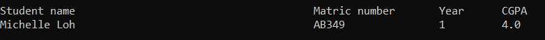

# Student Information System
Author: Michelle Loh

---

## Summary

This system uses a singly linked list to store and organize related to student information.  It allow operation such as adding new student’s information as well searching, deleting, and displaying the student information.

The system uses:
<ol>
    <li>Object-Oriented Programming (struc, class and object)</li>
    <li>Multiple Inheritance</li>
    <li>Abstract Class (Template)</li>
    <li>Operator Overloading</li>
</ol>

    

---
## Linked List Operations
1.	The student information should consist as follows:
    - Student name
    - Matric Number
    - Year
    - CGPA

2.	These linked list will store the information by:
    - Unordered Linked List
    - Ordered Linked

3.	Adding information:
    

        
Unordered Linked List

        <ul>
          <li>Add information based on the specific location (based on data arrival)</li>
        </ul>
    

    

        
Ordered Linked List

         <ul>
           <li>Case 1: The list is initially empty</li>
           <li>Case 2:  The list is not Empty</li>
           <li>Case 3:  The list is not Empty, and the student CGPA to be inserted is higher than the first node in the list. The node to be inserted somewhere is the list</li>
        </ul>
    

4.	Delete information:
    <ul>
    <li>Case 1:  The list is empty</li>
    <li>Case 2:  The node to be deleted is the first node</li>
    <li>Case 3:  The node to be deleted is the last node</li>
    <li>Case 4:  The list does not contain the node with the given info</li>
    </ul>

5.	Search/Retrieve based on user input 
